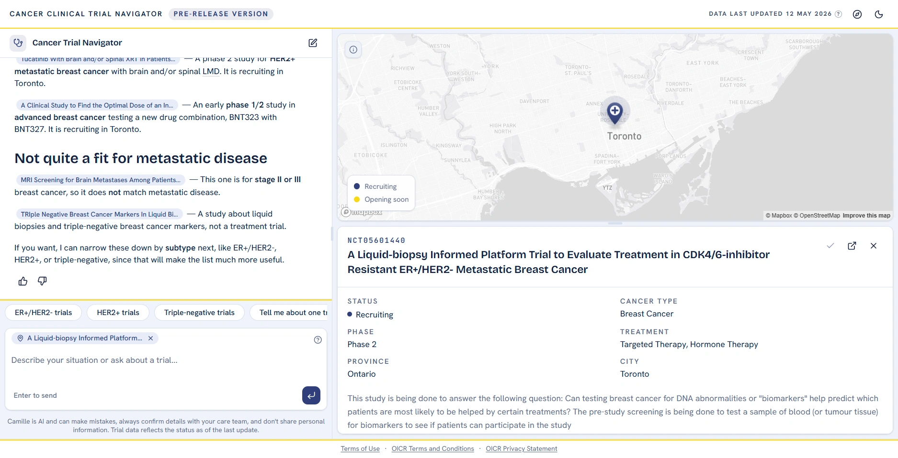

<div align="center">

# Cancer Clinical Trial Navigator

**Find a cancer clinical trial in Canada by having a conversation, and see every trial it cites on a map.**


[Documentation](https://realpailab.github.io/ClinicalTrialChatbot/docs) ·
[Architecture](https://realpailab.github.io/ClinicalTrialChatbot/docs/architecture) ·
[Running it locally](https://realpailab.github.io/ClinicalTrialChatbot/docs/development)

</div>

## What it is

Searching for a clinical trial normally means a filter form and a registry that answers in
terminology written for clinicians. This project replaces that with a conversation.

The assistant asks what it needs to know,
searches the trial database, and answers in plain language. Every trial it relies on is cited inline
and appears on the map as it is mentioned, so an answer can be checked rather than trusted.

It was built as a **Google Summer of Code 2026** project in collaboration with Open Genome
Informatics and the Ontario Institute for Cancer Research.

<div align="center">

</div>

## How it works

A React frontend and an async FastAPI backend. The agent is built with Pydantic AI and answers with a
set of tools and a set of guardrails between the model and the patient: a triage gate before it runs,
limits on its tool use, and a citation check on what it wrote. Trials are searched two ways, by hard
filters and by meaning, against PostgreSQL with pgvector. Every conversation is traced in Langfuse.

The [documentation](https://realpailab.github.io/ClinicalTrialChatbot/docs) covers all of it: the
architecture, the agent and its guardrails, the interface, deployment, observability and evaluation.

## Getting started

```bash
git clone https://github.com/RealPaiLab/ClinicalTrialChatbot.git
cd ClinicalTrialChatbot
```

Then follow
[Running it locally](https://realpailab.github.io/ClinicalTrialChatbot/docs/development), which
covers the prerequisites, the environment files and the database dump.

## Status

Pre-release. The system runs end to end and is focused on Ontario for now, with other provinces to
follow.

## License

Released under the [MIT License](LICENSE).

## Star history

<div align="center">
<a href="https://star-history.com/#RealPaiLab/ClinicalTrialChatbot&Date">
  
</a>
</div>
