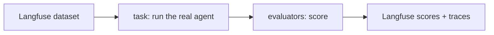

# Evaluation harness

Langfuse runs experiments over the agent; DeepEval supplies the LLM-judged metrics.

## How it fits together



`run_experiment` calls `dataset.run_experiment(task, evaluators)`. The task replays a
sample's conversation through the real agent and returns an `AgentEvalOutput`; each
evaluator scores it and writes a Langfuse score. Launch from the CLI or the webhook.

## Layout

- `schemas/`: the dataset-item contract (`input` / `expected_output`) + the task's `AgentEvalOutput`.
- `metrics/generic/`: **domain-blind** RAG metrics (purity-tested): `deterministic/` (context
  precision/recall) + `llm_judged/` (faithfulness, answer/contextual relevancy,
  correctness; thin DeepEval wrappers).
- `metrics/domain/`: clinical-trials metrics: tool correctness, glossary correctness, inline-citation
  consistency.
- `adapters/`: the only layer knowing both sides: `scoring.py` (the metric index) and `langfuse_evaluators.py` (wrap each metric as a Langfuse evaluator).
- `dataset/`: Langfuse-first access (`sources/`), `mapping.py` (sample ↔ Langfuse item), `seed.py`.
- `task/`: `run_agent.py`, the experiment task.
- `runner/`: `experiment.py` (the run) + `judge.py` (pooled DeepEval judge model).

## Run it

```bash
uv run python scripts/seed_eval_dataset.py        # bootstrap the Langfuse dataset (once)
uv run python scripts/run_evals.py --run-name dev # run an experiment (CLI)
```
